Recently I started learn SQL Server 2012 AlwaysOn Availability Group (AG). After reading some online documents, I couldn't wait to create my own Availability Group to practice it. Meanwhile, I had lots of trials and failures and learned a lot of new knowledge, and that's why I want to share the process. If you are also new to AG and want to get your hands wet with it, just follow me:)

Overall, there are 3 steps.
<ul>
	<li>Install Windows Servers and setup a test domain.</li>
	<li>Setup a Windows Failover Cluster.</li>
	<li>Create an AlwaysOn Availability Group.</li>
</ul>
Why do I need to setup a test domain? Well, because the title contains words "from scratch". And, more importantly, I don't have permission to create failover cluster object on my corporate domain. I believe that's the common case for most of the developers in a big company. So, let's start the details with server and domain setup. If you already have 2 servers in the same domain ready to use,<em> and</em> you also have permission to create Failover Clusters, you can skip step 1.

<strong>1. Install Windows Servers and setup a test domain</strong>

1.1. Install 3 servers with <strong>Windows Server 2012 R2 Datacenter </strong>edition. Name them <strong>SqlTestDC</strong>, <strong>SqlTest01</strong> and <strong>SqlTest02</strong>. <strong>SqlTestDC </strong>is the domain controller, while <strong>SqlTest01</strong> and <strong>SqlTest02</strong> are the AG replicas. I host all these 3 servers on my Hyper-V server.

<a href="images/5707.HyperV.png">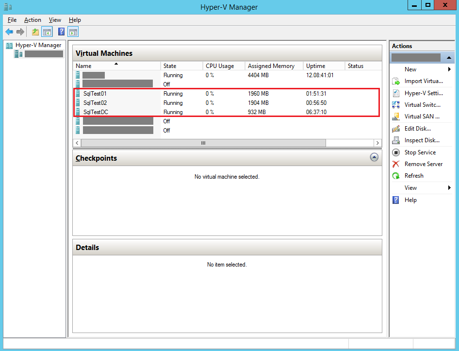</a>

1.2 Create the test Active Directory forest on <strong>SqlTestDC</strong>. Log on <strong>SqlTestDC</strong>, start <strong>PowerShell</strong> <strong>as Administrator</strong>, and run the below commands.
<pre class="scroll"><code class="csharp">Get-WindowsFeature AD-Domain-Services | Install-WindowsFeature
</code><code class="csharp">Get-WindowsFeature RSAT-ADDS-Tools | Install-WindowsFeature
Import-Module ADDSDeployment 
Install-ADDSForest -DomainName <span style="background-color: #ffff00">SqlTestDOM.contoso.com</span> -DomainNetbiosName <span style="background-color: #ffff00">SqlTestDOM</span> -DomainMode Win2012 -ForestMode Win2012 -DatabasePath "C:\Windows\NTDS" -SysvolPath "C:\Windows\SYSVOL" -LogPath "C:\Windows\NTDS" -InstallDns:$true -SafeModeAdministratorPassword $(ConvertTo-SecureString "<span style="background-color: #ffff00">&lt;password&gt;</span>" -AsPlainText -Force) -NoRebootOnCompletion:$false -Force</code></pre>
You can replace the highlighted parts with your own values. For the password, make it complex enough, "V3RYstr0n9Pa$$w0rd" is a good example.

SqlTestDC will be rebooted automatically and after that, log on it by user <span style="color: #000000"><strong>SqlTestDOM\Administra</strong>t<strong>or</strong>.</span>

<span style="color: #000000">To learn more about the parameters in creating an Active Directory forest, refer to this help page: <a href="http://technet.microsoft.com/library/hh974720(v=wps.620).aspx">http://technet.microsoft.com/library/hh974720(v=wps.620).aspx</a></span><span style="color: #000000">. To learn more about the Windows feature identifiers, refer to this document: <a href="http://technet.microsoft.com/en-us/library/cc732757.aspx">http://technet.microsoft.com/en-us/library/cc732757.aspx</a>.</span>

<span style="color: #000000">1.3 Change the <strong>DNS server</strong> for <strong>SqlTest01</strong> and <strong>SqlTest02</strong> to the IP address of <strong>SqlTestDC</strong>. Suppose that the IPv4 address of SqlTestDC is 157.59.140.111, then the DNS server address on SqlTest01 and SqlTest02 should be changed to 157.59.140.111.</span>

<span style="color: #000000"><a href="images/8468.SqlTest01DNS.png">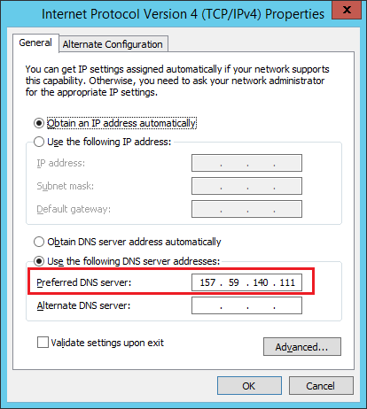</a></span>

<span style="color: #000000">1.4 Join <strong>SqlTest01</strong> and <strong>SqlTest02</strong> to <strong>SqlTestDOM.contoso.com</strong> domain. When prompt for credential, use <strong>SqlTestDOM\Administrator</strong>. After joined to <strong>SqlTestDOM.contoso.com</strong> domain, the System page of SqlTest01 should look like below screenshot. SqlTest02 is similar.</span>

<a href="images/2502.SqlTest01System.png">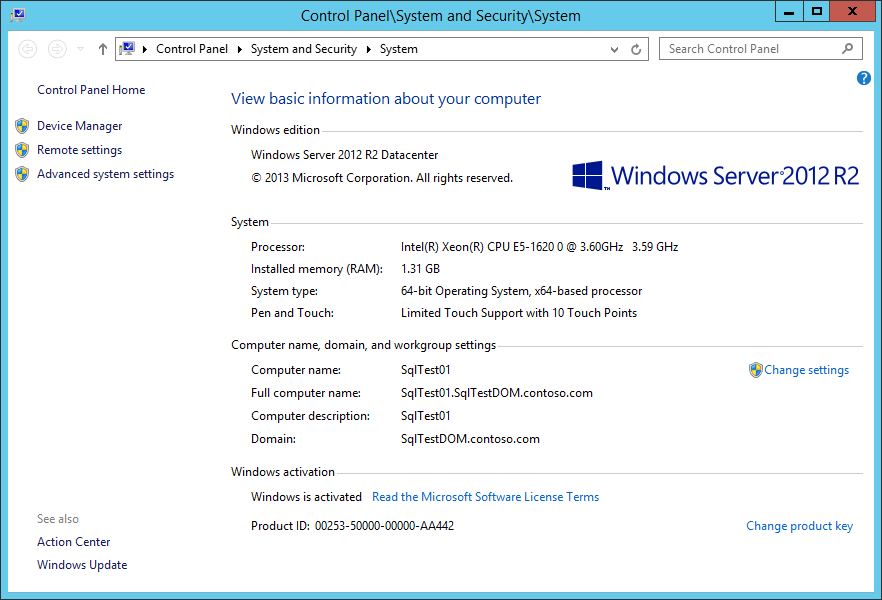</a>

After restarting, log on to SqlTest01 and SqlTest02 as user <strong>SqlTestDOM\Administrator</strong>.

1.5 Turn off<strong> Windows Firewall</strong> on all the three servers. This is a shortcut to avoid connection failure when setting up AG. This is valid only on test servers. On your production servers, open required ports instead.

<a href="images/7245.SqlTest01Firewall.png">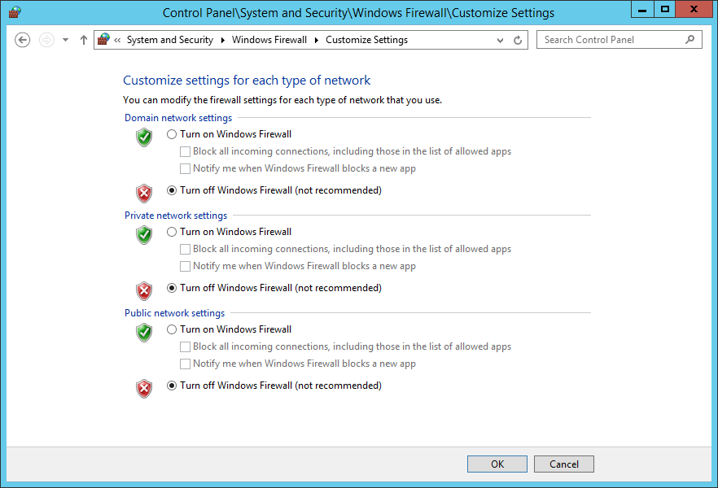</a>

<strong>2. Setup a Windows Failover Cluster</strong>

<span style="color: #000000">2.1 Install <strong>Failover Clustering</strong> feature on <strong>SqlTest01</strong> and <strong>SqlTest02</strong>. In Server Manager, click<strong> Add Roles and Features</strong>, and check <strong>Failover Clustering</strong> feature and click <strong>Next</strong> and then <strong>Install</strong>.</span>

<span style="color: #000000"><a href="images/1300.SqlTest01FailoerClusteringFeature.png">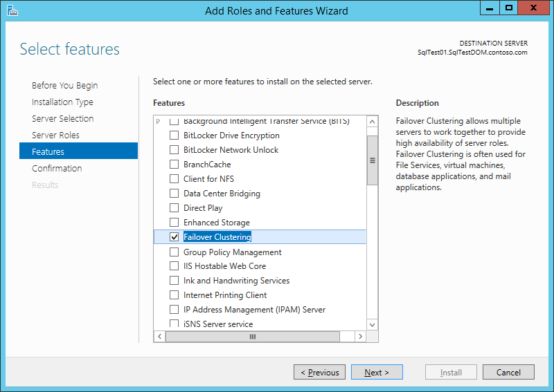</a></span>

2.2 After Failover Clustering feature is installed on SqlTest01 and SqlTest02, go to SqlTest01 and open <strong>Failover Cluster Manager</strong>. Right click <strong>Failover Cluster Manager </strong>node, and select <strong>Validate Configuration...</strong>.

<a href="images/7462.SqlTest01FailoverClusterManager.png"></a>

2.3 Follow the <strong>Validate a Configuration Wizard</strong>. Add <strong>SqlTest01</strong> and <strong>SqlTest02</strong> to <strong>Selected servers</strong>, and click <strong>Next</strong>.

<a href="images/1207.SqlTest01SelectServers.png">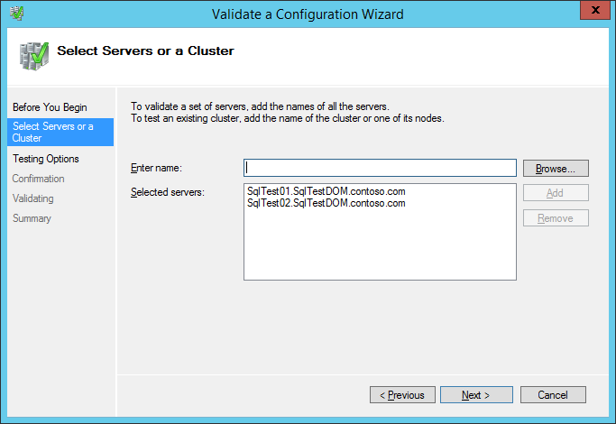</a>

2.4 Select <strong>Run all tests (recommended)</strong> in <strong>Testing Options</strong> page and press <strong>Next</strong>, and <strong>Next</strong> again on the <strong>Confirmation</strong> page.

<a href="images/4405.SqlTest01TestingOptions.png">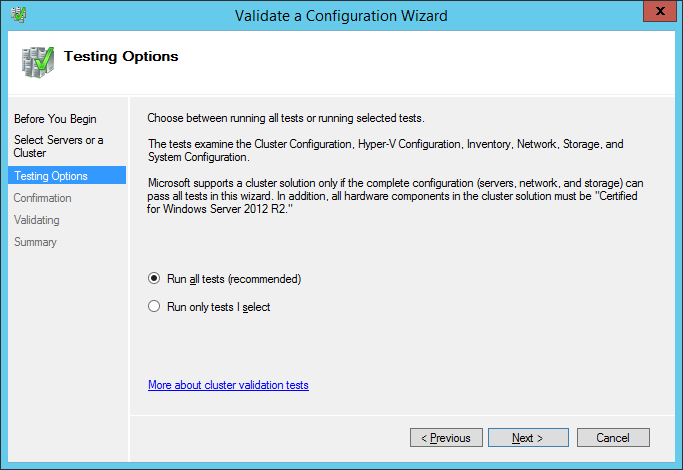</a>

2.5 Now tests are running to validate the failover cluster.

<a href="images/3583.SqlTest01Validating.png">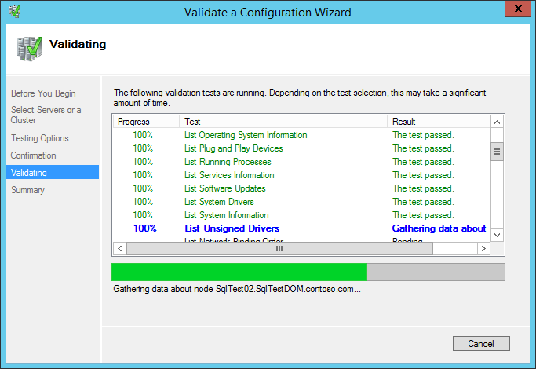</a>

2.6 The validation summary will be shown shortly. Click <strong>View Report...</strong> to check if there is any error.

<a href="images/0336.SqlTest01Summary.png">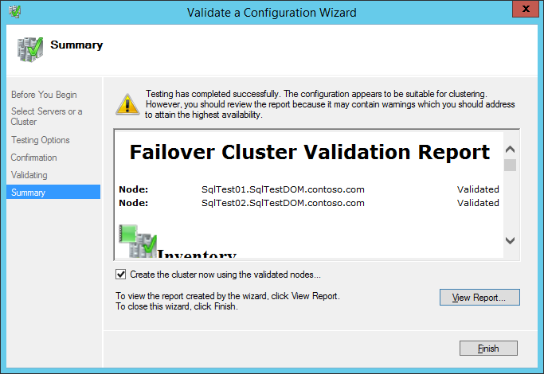</a>

In the validation report I got, there are several warnings, which relate to network and disk. They are not critical. So I just move on with Failover Cluster creation. Here is the validation report I got <a href="http://msdnblog.blob.core.windows.net/sqlag/FailoverClusterValidationReport.mht">http://msdnblog.blob.core.windows.net/sqlag/FailoverClusterValidationReport.mht</a>

2.7 Make sure that <strong>Create the cluster now using the validated nodes...</strong> is checked on the summary page above. Click <strong>Finish</strong> to create the Windows Failover Cluster.

2.8 Follow <strong>Create Cluster Wizard</strong>. On <strong>Access Point for Administering the Cluster</strong> page, input your desired <strong>Cluster Name</strong>. I use <strong>SqlTest</strong>. Click <strong>Next</strong>.

<a href="images/7318.SqlTest01ClusterName.png">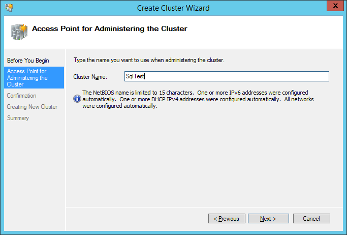</a>

2.8 On the Confirmation page, make sure that <strong>Add all eligible storage to the cluster</strong> is checked, and click <strong>Next</strong>.

<a href="images/3487.SqlTest01ClusterConfirmation.png">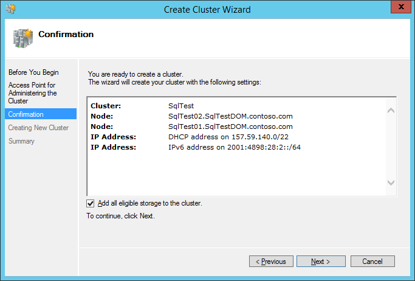</a>

2.9 Now <strong>Create Cluster Wizard</strong> is creating the new cluster for you.

<a href="images/6558.SqlTest01CreatingNewCluster.png">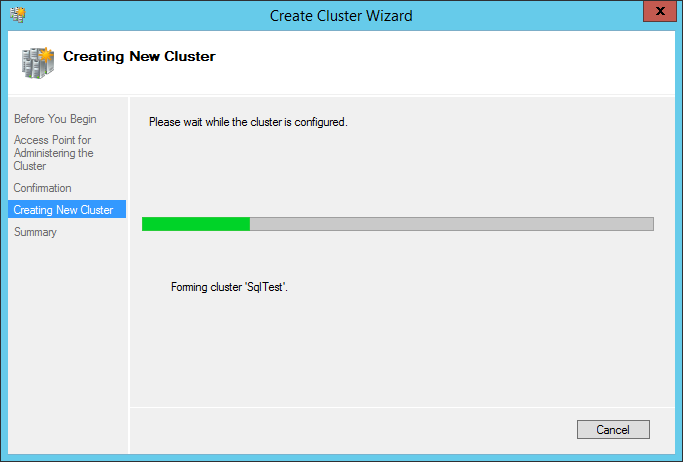</a>

Wait for a while and you will be told that "<strong>You have successfully completed the Create Cluster Wizard</strong>". Click <strong>View Report...</strong> to view the report, and then click <strong>Finish</strong> to dismiss the wizard. Here is the report that I got <a href="http://msdnblog.blob.core.windows.net/sqlag/CreateClusterSummaryReport.mht">http://msdnblog.blob.core.windows.net/sqlag/CreateClusterSummaryReport.mht</a>

<a href="images/7206.SqlTest01CreatingClusterSummary.png">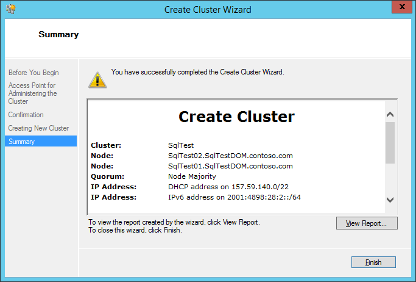</a>

Congratulation! Now you have created a failover cluster! One big step closer to the success of Availability Group creation:)

2.10 Now you can view the cluster <strong>SqlTest.SqlTestDOM.contoso.com</strong> in <strong>Failover Cluster Manager</strong>, on both <strong>SqlTest01</strong> and <strong>SqlTest02</strong>. And <strong>SqlTest01</strong> and <strong>SqlTest02 </strong>are in the<strong> Nodes </strong>of the failover cluster. Note that we only finished the Create Cluster Wizard on SqlTest01.

<a href="images/6840.SqlTest02SqlTestCluster.png">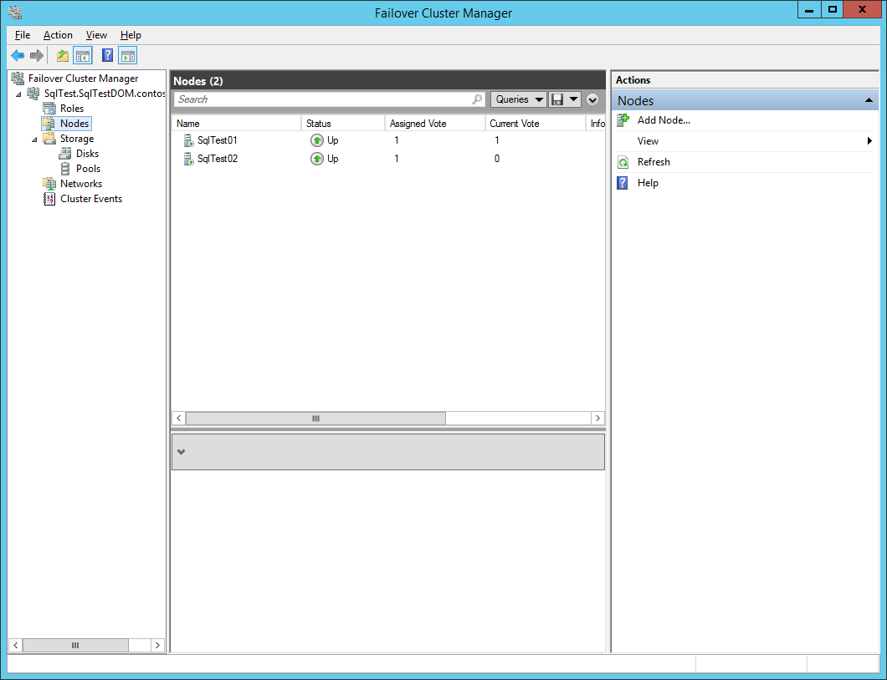</a>

2.11 (Optional) add a <strong>file share quorum</strong> to the failover cluster. It is necessary if you want your AG to support failover with data loss. Right click on the cluster name <strong>SqlTest.SqlTestDOM.contoso.com</strong>, and select <strong>More Actions</strong> &gt; <strong>Configure Cluster Quorum Settings</strong>.

<a href="images/0815.SqlTest01ConfigureClusterQuorumSettings.png">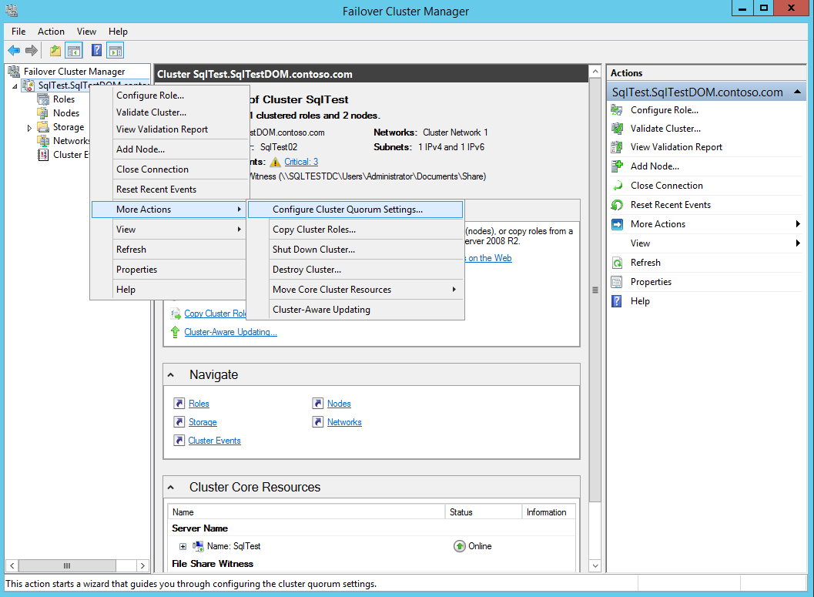</a>

Follow the Configure Cluster Quorum Wizard.

On <strong>Select Quorum Configuration Option</strong> page, choose <strong>Select the quorum witness</strong>, and click <strong>Next</strong>.

<a href="images/7455.SqlTest01SelectQuorumOption.png">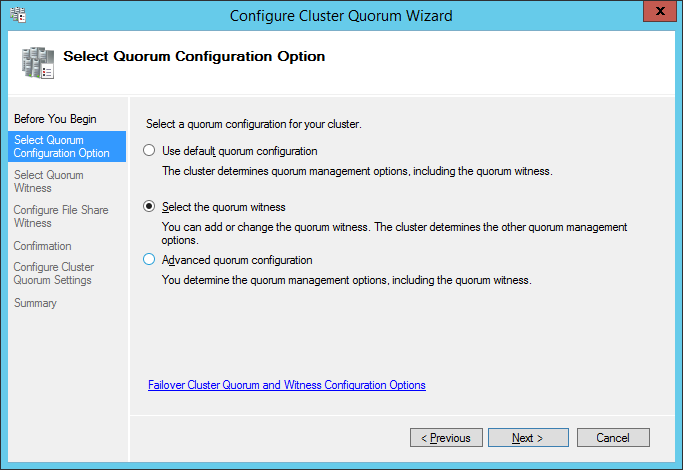</a>

Create a share folder on SqlTestDC, and make sure Read/Write permissions are granted to SqlTestDOM\Administrator. Input the <strong>File Share Path</strong> on <strong>Configure File Share Witness</strong> page. I use<strong> <a href="//\\SQLTESTDC\Users\Administrator\Documents\Share">\\SQLTESTDC\Users\Administrator\Documents\Share</a></strong>.

<a href="images/0028.SqlTest01FileShareWitness.png">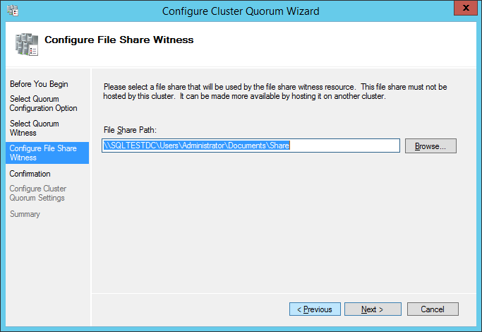</a>

Click <strong>Next</strong> on <strong>Confirmation</strong> page.

<a href="images/7711.SqlTest01ConfirmFileShareWitness.png">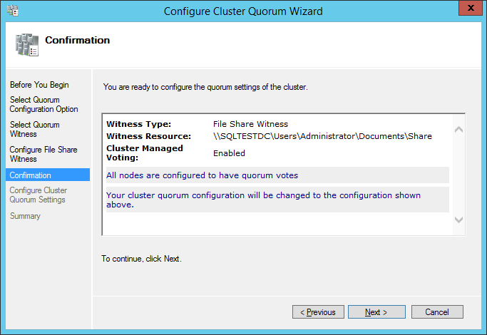</a>

You will be told that "<strong>You have successfully configured the quorum settings for the cluster</strong>" shortly.

<a href="images/3326.SqlTest01ConfigureClusterQuorumSettingsSummary.png">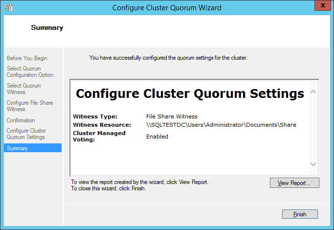</a>

We are done with the failover cluster creation and configuration at this moment. Let's move on to SQL Server installation and AG creation, which is the most exciting part!

<strong>3. Create an AlwaysOn Availability Group</strong>

3.1 Install <strong>SQL Server 2012 Enterprise Edition</strong> on <strong>SqlTest01</strong> and <strong>SqlTest02</strong>. According to "Features Supported by the Editions of SQL Server 2012" (<a href="http://msdn.microsoft.com/en-us/library/cc645993.aspx">http://msdn.microsoft.com/en-us/library/cc645993.aspx</a>), <strong>SQL Server 2012 Enterprise Edition</strong> is the only choice.

3.2 After installation of <strong>SQL Server 2012 Enterprise Edition</strong>, change the Log On account of SQL Server to SqlTestDOM\Administrator. To do so, open <strong>SQL Server Configuration Manager</strong>, choose <strong>SQL Server Services</strong>, and right click <strong>SQL Server (MSSQLSERVER)</strong>, choose<strong> Properties</strong> in the context manual.

<a href="images/0312.SqlTest01SQLServerProperty.png">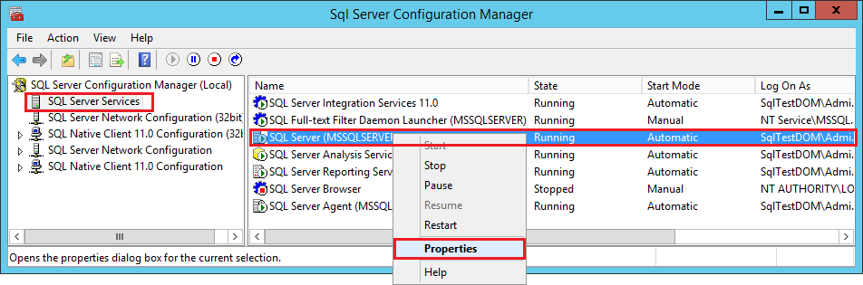</a>

Under <strong>Log On </strong>tab, select <strong>This account:</strong>, and input <strong>SqlTestDOM\Administrator</strong> and its password.

<a href="images/6013.SqlTest01ChangeSQLAccount.png">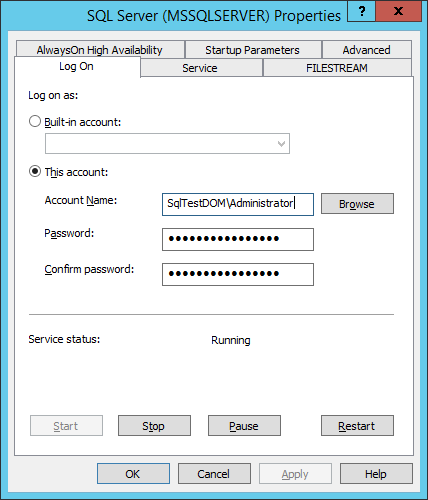</a>

3.3 Verify that the <strong>AlwaysOn Availability Group</strong> is enabled on <strong>SqlTest01</strong> and <strong>SqlTest02</strong>. To do so, open <strong>SQL Server Configuration Manager</strong>, choose <strong>SQL Server Services</strong>, and right click <strong>SQL Server (MSSQLSERVER)</strong>, choose<strong> Properties</strong> in the context manual, and <strong>SQL Server (MSSQLSERVER)\Properties</strong>. Under <strong>AlwaysOn High Availability</strong> tab, ensure that the <strong>Enable AlwaysOn Availability Groups</strong> check box is checked.

<a href="images/6232.SqlTest01EnableAG.png"></a>

3.4 Connect to SQL Server engine on <strong>SqlTest01</strong> via<strong> SQL Server Management Studio. </strong>Create a database on <strong>SqlTest01</strong>. Name it <strong>AGTest01</strong>.

<a href="images/0003.SqlTest01NewDB.png">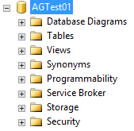</a>

3.5 Right click database node <strong>AGTest01</strong>, click <strong>Properties…</strong>, and go to <strong>Options</strong> page. Change the <strong>Recovery model</strong> to <strong>Full</strong>.

<a href="images/3487.SqlTest01DBFullRecovery.png">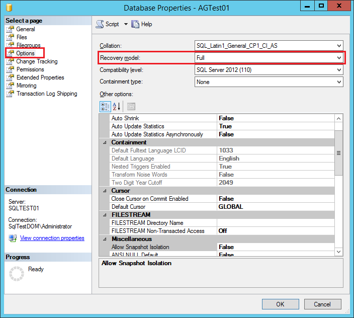</a>

3.6 Create a full backup for <strong>AGTest01</strong>. Right click database node <strong>AGTest01</strong>, click <strong>Task</strong> &gt; <strong>Back Up…</strong>. Leave the settings on <strong>Back Up Database - AGTest01</strong> as their default values, and click <strong>OK</strong>. When prompted that the backup was created successfully, click <strong>OK</strong> to dismiss.

<a href="images/3034.SqlTest01BackUpDB.png">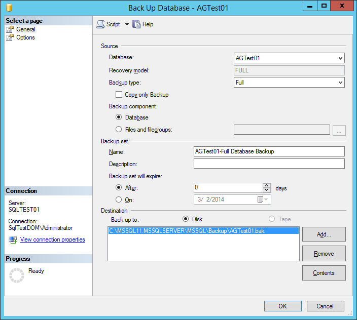</a>

3.7 Finally, we are ready to create the first Availability Group. Whew...

On <strong>SqlTest01</strong>, right click <strong>AlwaysOn High Availability</strong>, and click <strong>New Availability Group Wizard…</strong>.

<a href="images/0842.SqlTest01NewAG.png">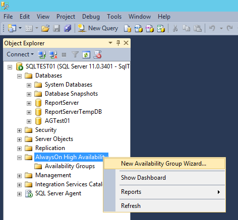</a>

On the <strong>Specify Name</strong> page, insert the <strong>Availability group name</strong> that you like. I will call it <strong>MyAG01</strong>.

<a href="images/0513.SqlTest01NewAGSpecifyName.png">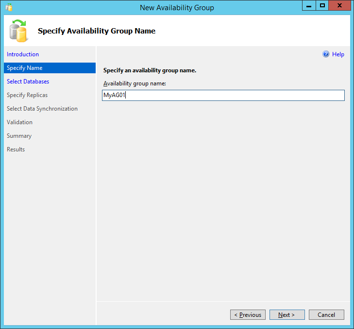</a>

Check database <strong>AGTest01</strong> on <strong>Select Databases</strong> page. Only databases with Full Recovery Model and a full back up meet the requirements to join an Availability Group.

<a href="images/3022.SqlTest01NewAGSelectDatabases.png">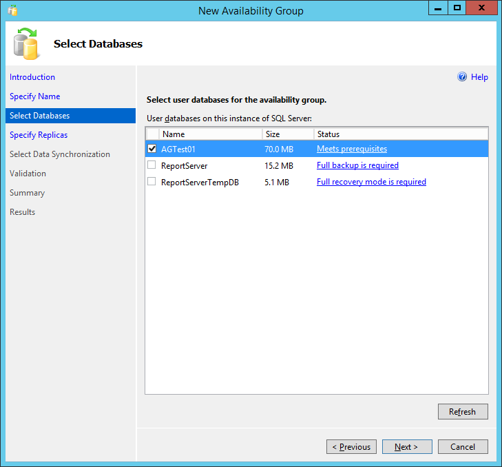</a>

On <strong>Specify Replica</strong> page, add <strong>SqlTest01</strong> and <strong>SqlTest02</strong> to <strong>Replicas</strong> tab. Don't worry about the Automatic Failover and Synchronous Commit settings at this moment. You will be able to configure them after the AG is created.

<a href="images/6505.SqlTest01NewAGSpecifyReplicas.png">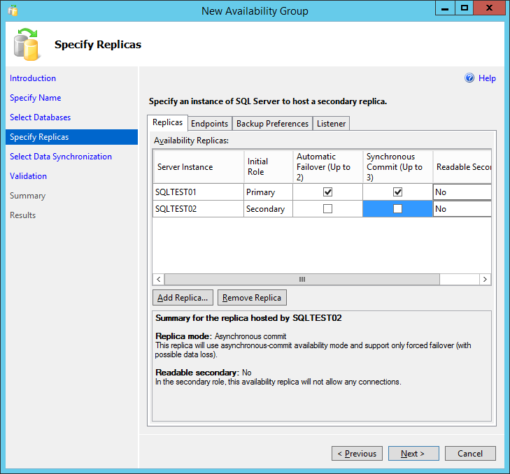</a>

Make sure that the <strong>Endpoint URL</strong>s in <strong>Endpoints</strong> tab are using port <strong>5022</strong>.

<a href="images/4520.SqlTest01NewAGEndpoints.png">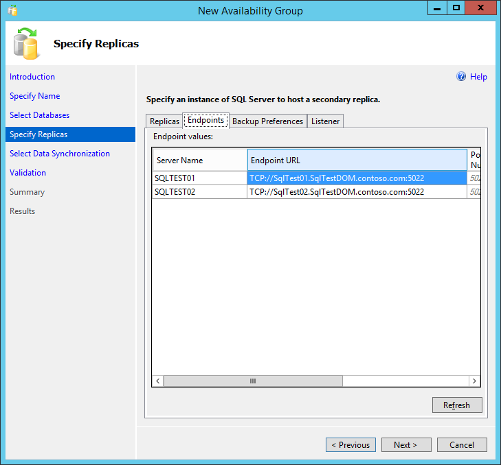</a>

Leave the default settings in <strong>Backup References</strong> tab unchanged.

<a href="images/6866.SqlTest01NewAGBackupPreferences.png">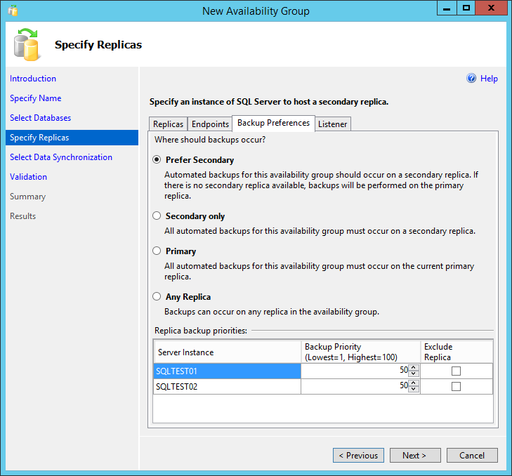</a>

On <strong>Listener</strong> page, input the <strong>Listener DNS Name </strong>you like (I use <strong>MyAG01</strong>), input 1433 as Port, <strong>DHCP</strong> as <strong>Network Mode</strong>, and choose the IPv4 subnet. I choose to use DHCP because I don't have the permission to reserve a static IP address in the DHCP server.

<a href="images/1134.SqlTest01NewAGListener.png">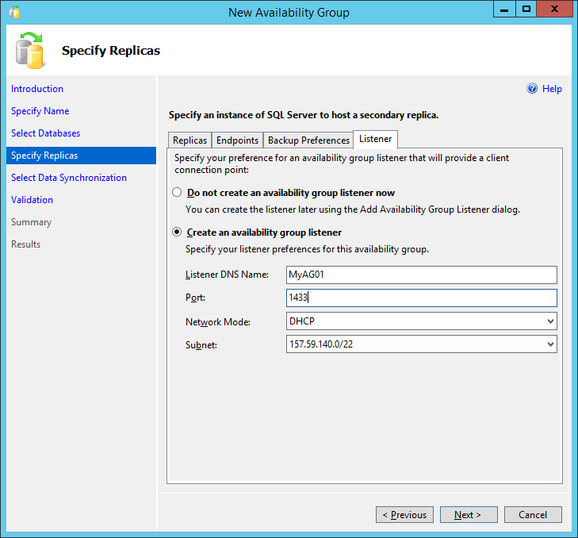</a>

On <strong>Select Data Synchronization</strong> page, <strong>choose</strong> Full and specify a <strong>shared network location</strong>. I use a share folder on SqlTestDC, but you can use anyone as long as the SQL Server service account has read and write permissions to that share folder.

<a href="images/1033.SqlTest01NewAGInitDataSync.png">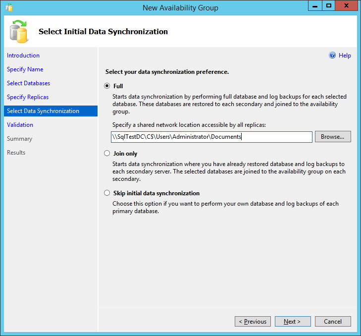</a>

Run validations on <strong>Validation</strong> page. Make sure there is no error.

<a href="images/5556.SqlTest01NewAGValidation.png">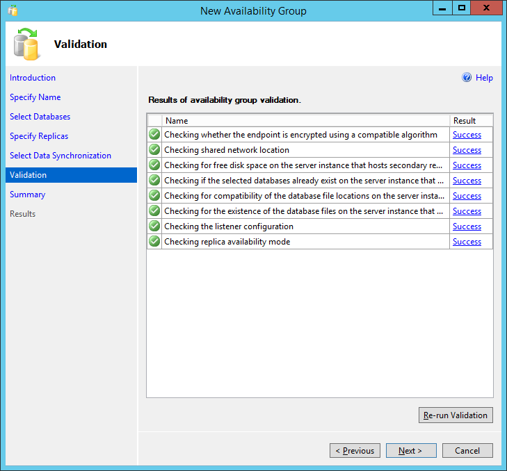</a>

On <strong>Summary</strong> page, you can get the SQL script to create the AG by clicking <strong>Script</strong> &gt; <strong>File...</strong>. Here is the script that I got <a href="http://msdnblog.blob.core.windows.net/sqlag/NewAvailabilityGroup.sql">http://msdnblog.blob.core.windows.net/sqlag/NewAvailabilityGroup.sql</a>.

Click <strong>Finish</strong>.

<a href="images/4478.SqlTest01NewAGSummary.png">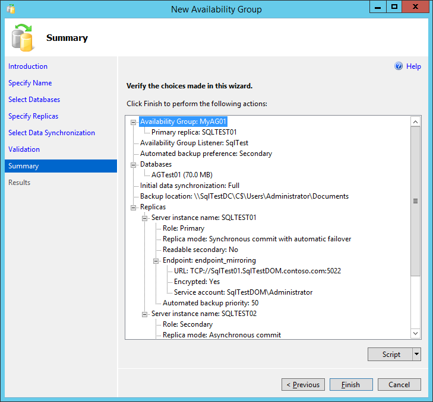</a>

Wow! You have successfully created your first Availability Group! Click <strong>Close</strong> on the <strong>Results</strong> page.

<a href="images/2781.SqlTest01NewAGResults.png"></a>

3.8 If you go to the <strong>Failover Cluster Manager</strong> on <strong>SqlTest01</strong> and <strong>SqlTest02</strong>, you will find that there is an entry named <strong>MyAG01</strong> created automatically under the <strong>Nodes</strong> of the failover cluster <strong>SqlTest.SqlTestDOM.contoso.com</strong>. The name <strong>MyAG01</strong> matches the one we specified for <strong>Listener DNS Name</strong> when we created the AG.

<a href="images/8562.SqlTest01FailoverClusterManagerNewRole.png">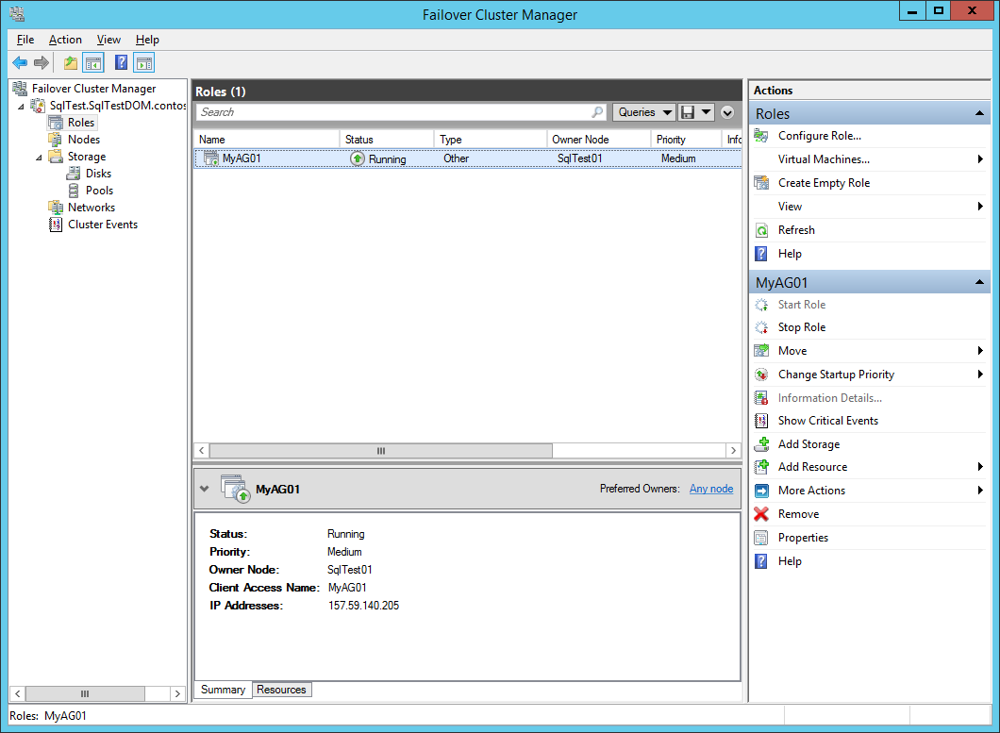</a>

3.9 Open <strong>DNS Manager</strong> on <strong>SqlTestDC</strong>, and you will find a new Host (A) has been created automatically. Its name, <strong>MyAG01</strong>, matches the <strong>Listener DNS Name</strong> when we used when creating the AG.

<a href="images/1104.SqlTestDCDNSManager.png">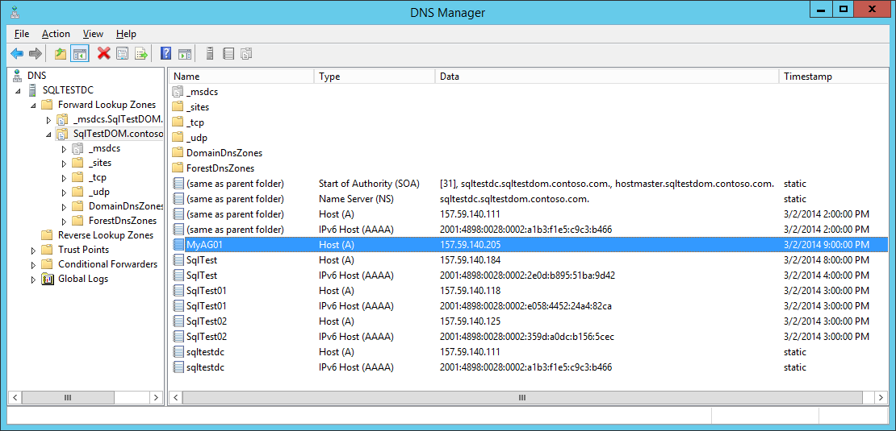</a>

3.10 You can <strong>ping</strong> <strong>MyAG01</strong> within your local network. The ping can succeed only when the Primary replica is alive. That means it is the primary replica server that is responding.

<a href="images/3771.SqlTestDCPingMyAG01.png">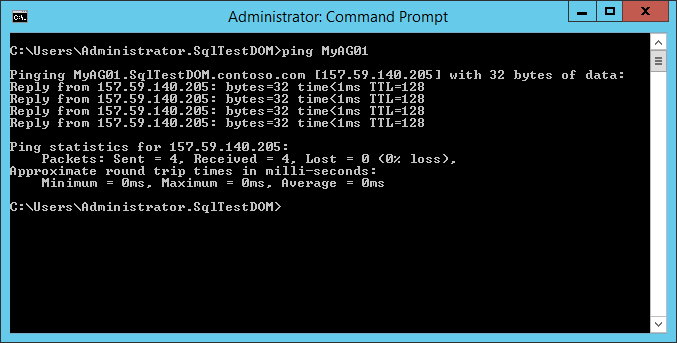</a>

3.11 View <strong>SqlTest01</strong> and <strong>SqlTest02</strong> from <strong>SQL Server Management Studio</strong>. Note that <strong>SqlTest01</strong> is the <strong>Primary</strong> server in the AG, while <strong>SqlTest02</strong> is the <strong>Secondary</strong>.

<a href="images/7282.SqlTest0102AG.png">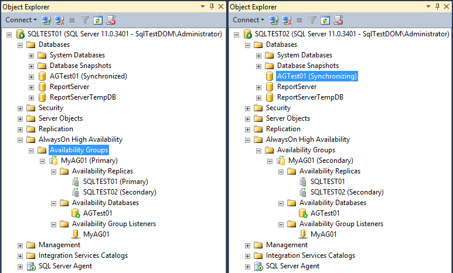</a>

3.12 If you attempt to expand the database node <strong>AGTest01</strong> on <strong>SqlTest02</strong>, you will get an error that "The database AGTest01 is not accessible." That is because Readable Secondary is set to "No" for SqlTest02.

<a href="images/2043.SqlTest02DBNotAccessible.png">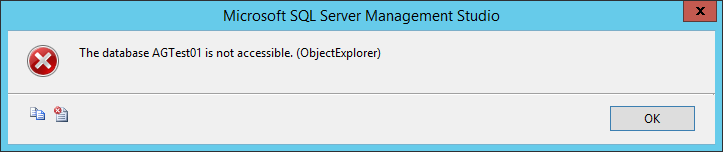</a>

3.13 Let's do a failover now. On <strong>SqlTest01</strong>, right click the node <strong>MyAG01</strong> (Primary), and select <strong>Failover...</strong>.

<a href="images/4466.SqlTest01Failover.png">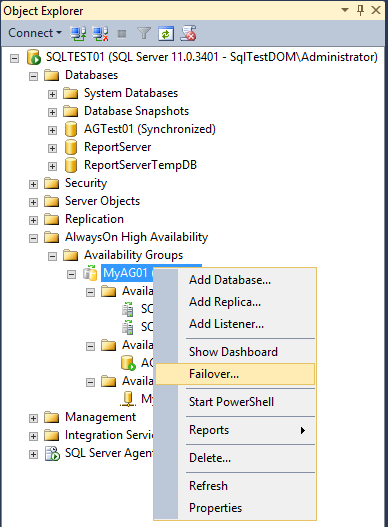</a>

On the <strong>Select New Primary Replica</strong> page, you will see a warning. By <strong>clicking Data loss, Warnings(1)</strong>, the details of the warning is displayed. It complains about that replica SqlTest02 has some databases that are not synchronized. That's because we left the <strong>Synchronous Commit</strong> box unchecked on the <strong>Specify Replica </strong>page in step 3.7. Although it is still possible to do a failover with data loss, let's cancel the failover now. Click the <strong>Cancel</strong> button.

<a href="images/5430.SqlTest01FailoverSelectNewPrimary.png">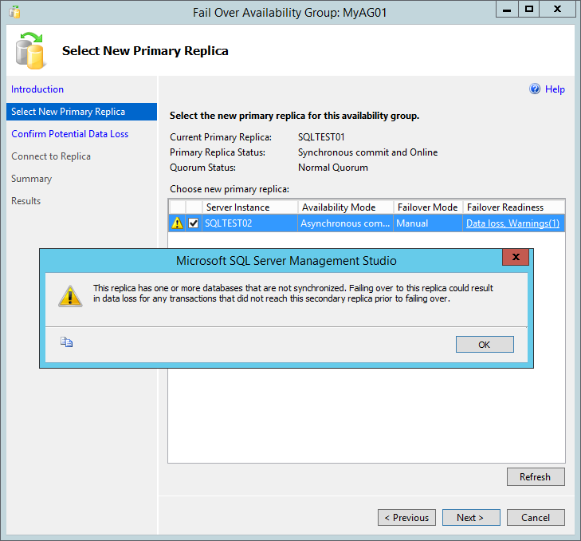</a>

3.14 Right click the AG node <strong>MyAG01 (Primary)</strong> on <strong>SqlTest01</strong>. On the <strong>General</strong> page, change the <strong>Availability Mode</strong> to <strong>Synchronous commit</strong> for <strong>SqlTest02</strong>. Click <strong>OK</strong>.

<a href="images/8371.SqlTest02SyncCommit.png">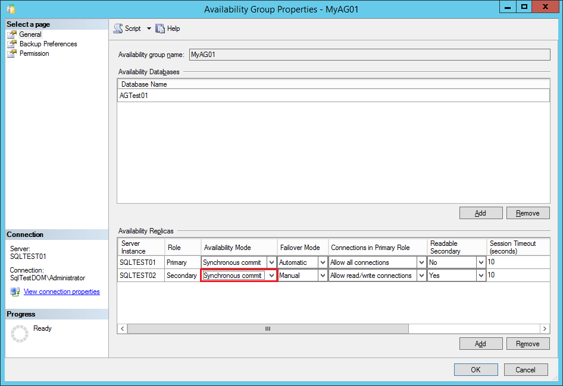</a>

3.15 Now, if you try to failover again, there will be no warnings.

<a href="images/5618.SqlTest01FailoverNoDataLoss.png">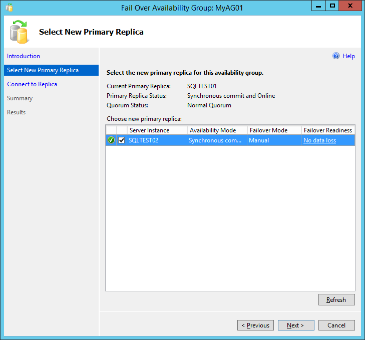</a>

Click <strong>Next</strong>. On <strong>Connect to Replica</strong> page, click <strong>Connect...</strong> and connect to <strong>SqlTest02</strong> with account <strong>SqlTestDOM\Administrator</strong>. The <strong>Next</strong> button is not enabled until you are able to connect to SqlTest02.

<a href="images/8284.SqlTest01FailoverConnect.png">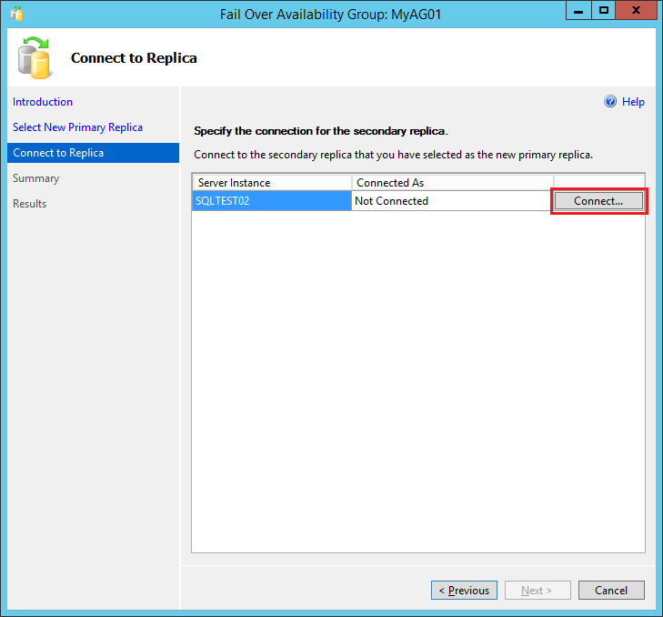</a>

On the Summary page, you can save the SQL script for AG failover by selecting <strong>File</strong> &gt; <strong>Script...</strong>. Here is the script I got <a href="http://msdnblog.blob.core.windows.net/sqlag/AGFailover.sql">http://msdnblog.blob.core.windows.net/sqlag/AGFailover.sql</a>

<a href="images/7181.SqlTest01FailoverSummary.png">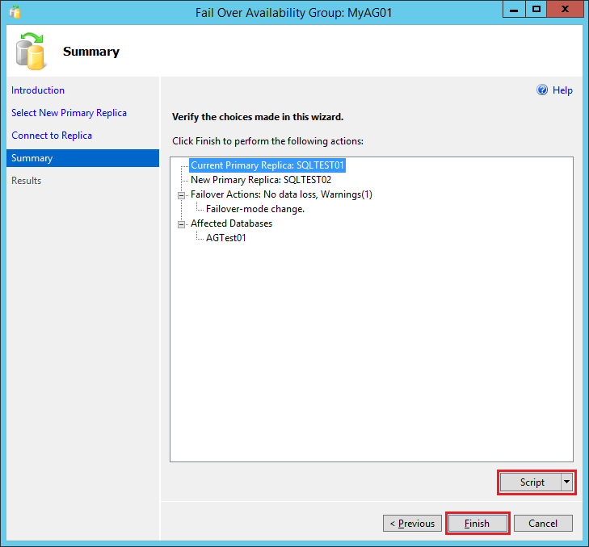</a>

Click <strong>Finish</strong> and the failover will complete shortly.

<a href="images/6505.SqlTest01FailoverResults.png">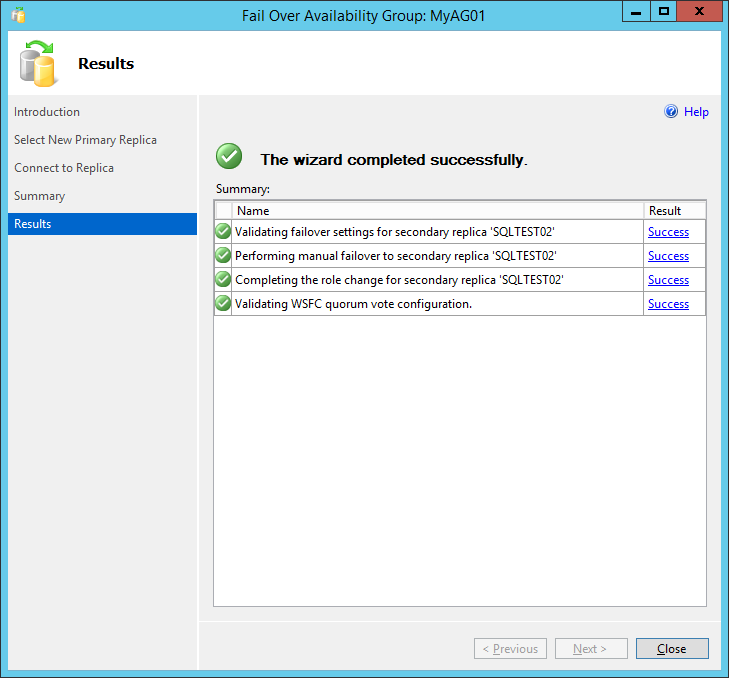</a>

3.16 Let's write some C# code to connect to the database in AG MyAG01. Assume that you've created a table called Table1 in database AGTest01.
```
public static void Main(string[] args)
{
    string connectionString = "Data Source=<span style="background-color: #ffff00">MyAG01</span>;Initial Catalog=AGTest01;Connection TimeOut=60;Max Pool Size=1000;Integrated Security=SSPI;persist security info=False";

     using (SqlConnection connection = new SqlConnection(connectionString))
     {
         connection.Open();
         Console.WriteLine("DataSource: {0}", connection.DataSource);
 
         using (SqlCommand sqlCommand = connection.CreateCommand())
         {
             sqlCommand.CommandText = "SELECT * FROM Table1";
             sqlCommand.CommandType = CommandType.Text;
 
             sqlCommand.ExecuteReader();
         }
     }
 }
 ````
Run this application on SqlTestDC, and you will see the output is **MyAG01**, i.e., the Listener DNS name. BTW, that is different from SQL Mirroring, in which the DataSource is the current principal server.

3.17 Now you can play with Availability Group by yourself. Try various <strong>Availability Mode</strong>s, <strong>Failover Mode</strong>s, replica readability settings, adding more databases and/or more replicas, etc. Before that, don't forget to take a checkpoint for the servers, so that you can rollback to the current status easily. Enjoy!
