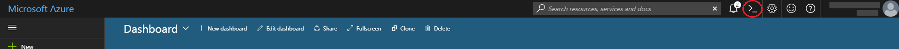
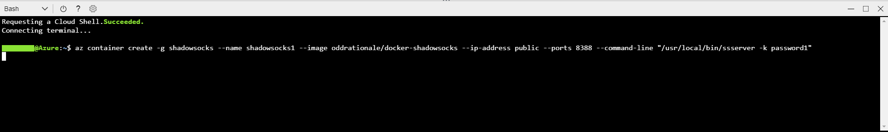
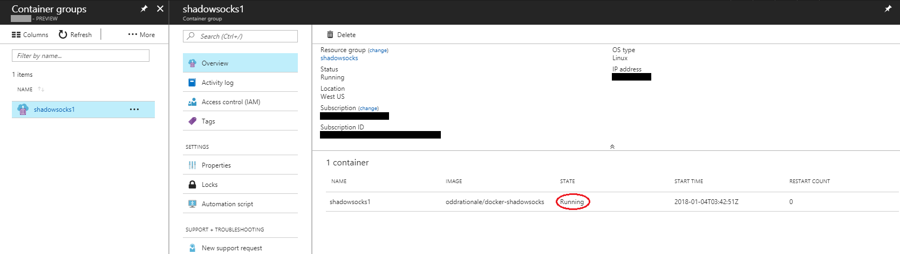
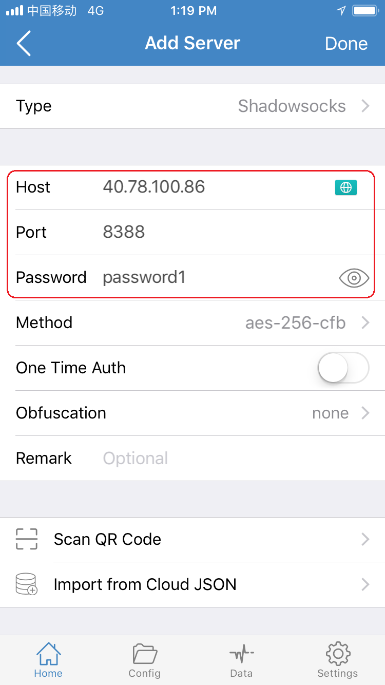
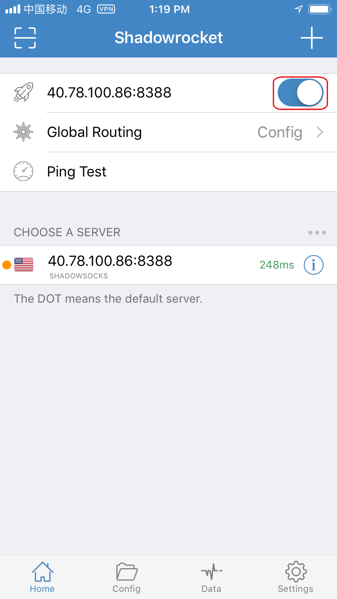
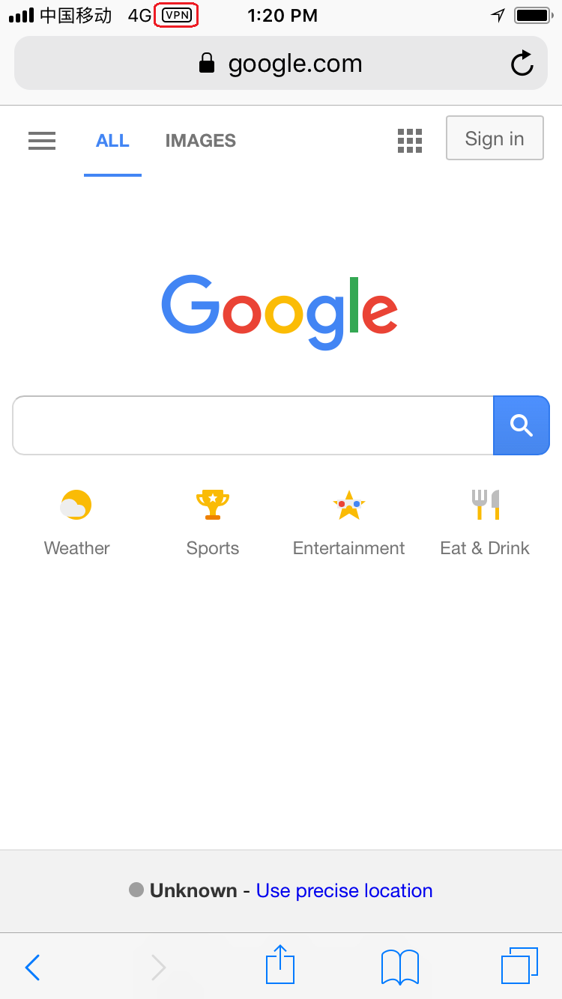

# Run Shadowsocks in Azure Container Instances (ACI)

VPN is very useful in mainland China, and <a href="https://shadowsocks.org">Shadowsocks</a> is a popular proxy server. Now that <a href="https://hub.docker.com/r/oddrationale/docker-shadowsocks/">Shadowsocks has docker support</a>, and we can host docker containers on Azure, it becomes very easy to deploy Shadowsocks on Azure. In this post, I'll show you how to deploy a Shadowsocks server on <a href="https://azure.microsoft.com/en-us/services/container-instances/">Azure Container Instances</a> in <strong>just one command</strong>.

I assume that you already have an Azure subscription at hand and there is at least one <a href="https://docs.microsoft.com/en-us/azure/azure-resource-manager/resource-group-portal">resource group</a> in it. <a href="https://azure.microsoft.com/en-in/free/">Create a free one</a> if you haven't yet.

To run the command to create a running Shadowsocks server, go to <a href="https://portal.azure.com">Azure Portal</a>, click the Cloud Shell icon in the top bar.

In the Cloud Shell that pops up at the bottom, make sure <strong>Bash</strong> is selected since the command is in Azure CLI. Type the below command.
<pre>az container create -g shadowsocks --name shadowsocks1 --image oddrationale/docker-shadowsocks --ip-address public --ports 8388 --command-line "/usr/local/bin/ssserver -k password1"</pre>

In the above command,
<ul>
 	<li><a href="https://docs.microsoft.com/en-us/cli/azure/container"><code>az container create</code></a> indicates Azure to create an Azure Container Instance.</li>
 	<li><code>-g shadowsocks</code> specifies the resource group name. My resource group name is shadowsocks, but yours can be different. The resource group has to be in West US, East US or West Europe, since Azure Container Instance is not available in other regions yet.</li>
 	<li><code>--name shadowsocks1</code> specifies the container instance's name. Yours can be different.</li>
 	<li><code>--image oddrationale/docker-shadowsocks</code> specifies to use the Docker image <a href="https://hub.docker.com/r/oddrationale/docker-shadowsocks/">oddrationale/docker-shadowsocks</a> on Docker Hub.</li>
 	<li><code>--ip-address public</code> The IP address of the container instance must be public so that you can connect to it from your client phone or desktop.</li>
 	<li><code>--ports 8388</code> Opens port 8388 to the public, which is the port where Shadowsocks server works on by default. It is equivalant to <code>-e 8388 -p 8388:8388</code> if you use <code>docker run</code> command.</li>
 	<li><code>--command-line "/usr/local/bin/ssserver -k password1"</code> indicates to run ssserver (Shadowsocks server) when the container starts. <code>-k password1</code> specifies the password when you connect to the server. Use your own strong password (don't use simple ones, and avoid special characters like '$').</li>
</ul>
Running the above script in Cloud Shell will return a JSON object, which means the creation is successful.

To verify that the Shadowsocks server is running well, navigate to the container group that you created and check its <strong>STATE</strong>. It should be <strong>Running</strong> if everything went smooth. Remember the IP address, which you will use when you connect to the server.

With just one command, we've got a Shadowsocks server running in Azure Container Instance.

Just for completeness, I'll show you how to use connect to the server from iOS.
<ol>
 	<li>Install <a href="https://itunes.apple.com/us/app/shadowrocket/id932747118">Shadowrocket</a> from App Store. When first run, you need to grant permission to the app to write VPN settings. Other Shadowsocks client apps also work.</li>
 	<li>Add a server and fill in the <strong>Host</strong>, <strong>Port</strong> and <strong>Password</strong> fields accordingly. Leave other fields as default.</li>
 	<li>Toggle the connect button to connect to the Shadowsocks server.</li>
 	<li>Now you can open Google from mainland China!</li>
</ol>
  
